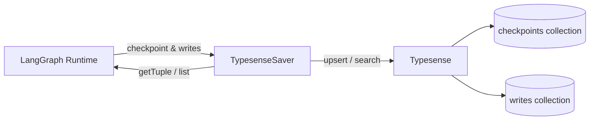

<div align="center">

# 🔍 typesense-langgraph-checkpointer

**LangGraph checkpoint saver backed by [Typesense](https://typesense.org/) — for Python and JavaScript/TypeScript.**

[](https://github.com/assim98/typesense-langgraph-checkpointer/actions/workflows/js.yml)
[](https://github.com/assim98/typesense-langgraph-checkpointer/actions/workflows/python.yml)
[](https://pypi.org/project/langgraph-checkpoint-typesense/)
[](https://www.npmjs.com/package/@assim98/typesense-langgraph-checkpointer)
[](LICENSE)

[Features](#-features) · [Installation](#-installation) · [Quick Start](#-quick-start) · [API Reference](#-api-reference) · [Development](#-development) · [Contributing](#-contributing)

</div>

---

## ✨ Features

- **Drop-in LangGraph saver** — implements the full `BaseCheckpointSaver` interface
- **Dual-language** — first-class Python **and** TypeScript packages from the same repo
- **Blazingly fast search** — leverages Typesense's in-memory engine for sub-millisecond checkpoint retrieval
- **Thread management** — full CRUD for threads, checkpoints, and pending writes
- **Automatic schema setup** — call `setup()` once and collections are created for you
- **Zero-config local dev** — Docker Compose included for instant Typesense instance

---

## 📦 Installation

### Python

```bash
pip install langgraph-checkpoint-typesense
```

### JavaScript / TypeScript

```bash
npm install @typesense-langgraph/checkpoint
```

---

## 🚀 Quick Start

### Python

```python
import typesense
from langgraph_checkpoint_typesense import AsyncTypesenseSaver

# 1. Create the saver
saver = AsyncTypesenseSaver.from_config(
    host="localhost",
    port=8108,
    api_key="your-api-key",
    protocol="http",
)

# 2. Initialize collections (run once)
await saver.setup()

# 3. Use with any LangGraph graph
from langgraph.graph import StateGraph

graph = StateGraph(...)
# ... define your nodes & edges ...
app = graph.compile(checkpointer=saver)

# 4. Invoke with a thread
config = {"configurable": {"thread_id": "my-thread"}}
result = await app.ainvoke({"input": "hello"}, config)
```

### JavaScript / TypeScript

```typescript
import { TypesenseSaver } from "@typesense-langgraph/checkpoint";

// 1. Create the saver
const saver = TypesenseSaver.fromConfig({
  host: "localhost",
  port: 8108,
  apiKey: "your-api-key",
  protocol: "http",
});

// 2. Initialize collections (run once)
await saver.setup();

// 3. Use with any LangGraph graph
import { StateGraph } from "@langchain/langgraph";

const graph = new StateGraph(...)
  // ... define your nodes & edges ...
  .compile({ checkpointer: saver });

// 4. Invoke with a thread
const config = { configurable: { thread_id: "my-thread" } };
const result = await graph.invoke({ input: "hello" }, config);
```

---

## ⚙️ Configuration

| Parameter | Python | JS/TS | Default | Description |
| --- | --- | --- | --- | --- |
| Host | `host` | `host` | `localhost` | Typesense server hostname |
| Port | `port` | `port` | `8108` | Typesense API port |
| API Key | `api_key` | `apiKey` | — | Typesense API key |
| Protocol | `protocol` | `protocol` | `http` | `http` or `https` |
| Timeout | `connection_timeout_seconds` | `connectionTimeoutSeconds` | `5` | Connection timeout in seconds |

You can also pass a pre-configured Typesense `Client` directly to the constructor.

---

## 📖 API Reference

### Python — `AsyncTypesenseSaver`

| Method | Description |
| --- | --- |
| `from_config(cls, **kwargs)` | Create a saver from connection parameters |
| `setup()` | Create Typesense collections if they don't exist |
| `aget_tuple(config)` | Retrieve a checkpoint tuple |
| `aput(config, checkpoint, metadata, new_versions)` | Store a checkpoint |
| `aput_writes(config, writes, task_id)` | Store pending writes |
| `alist(config, *, filter, before, limit)` | List checkpoint tuples |
| `adelete_thread(thread_id)` | Delete all data for a thread |

### JavaScript / TypeScript — `TypesenseSaver`

| Method | Description |
| --- | --- |
| `fromConfig(config)` | Create a saver from connection parameters |
| `setup()` | Create Typesense collections if they don't exist |
| `getTuple(config)` | Retrieve a checkpoint tuple |
| `put(config, checkpoint, metadata, newVersions)` | Store a checkpoint |
| `putWrites(config, writes, taskId)` | Store pending writes |
| `list(config, options?)` | Async-generator of checkpoint tuples |
| `deleteThread(threadId)` | Delete all data for a thread |

---

## 🏗️ Architecture



The saver manages two Typesense collections:

- **`langgraph_checkpoints`** — stores serialized checkpoint state, metadata, and channel versions
- **`langgraph_writes`** — stores pending writes keyed by `(thread_id, checkpoint_id, task_id, idx)`

Both collections are created automatically by `setup()` with optimized schemas and sorting fields.

---

## 🛠️ Development

### Prerequisites

- [Docker](https://docs.docker.com/get-docker/)
- Python ≥ 3.9
- Node.js ≥ 22

### Start Typesense

```bash
docker compose up -d
```

Default API key: `test-api-key` (override with `TYPESENSE_API_KEY` env var).

### Python

```bash
cd python
python -m venv .venv && source .venv/bin/activate
pip install -e ".[dev]"
pytest tests/ -v
```

### JavaScript / TypeScript

```bash
cd js
npm ci
npm run build
npm test
```

---

## 🤝 Contributing

Contributions are welcome! Please read the [Contributing Guide](CONTRIBUTING.md) and the [Code of Conduct](CODE_OF_CONDUCT.md) before opening a PR.

---

## 📄 License

This project is licensed under the [MIT License](LICENSE).
